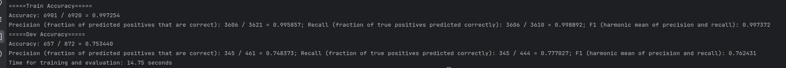

# Assignment 1: Sentiment Classification
Full assignment available [here](https://www.cs.utexas.edu/~gdurrett/courses/online-course/a1.pdf)

## Part 1: Perceptron (40 points)

Implement unigram perceptron. To get receive full credit you must get at least 74% accuracy on the 
development set, and it should run in less than 20 seconds. 

**Best Performance (learning_rate=.05, n_epochs=40):**

