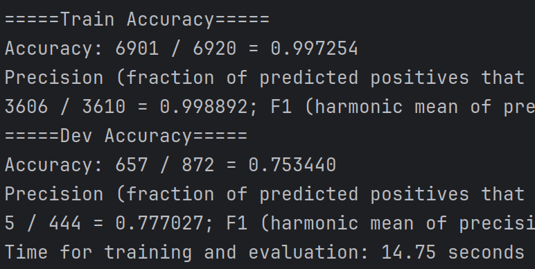

# Assignment 1: Sentiment Classification
Full assignment available [here](https://www.cs.utexas.edu/~gdurrett/courses/online-course/a1.pdf)

## Part 1: Perceptron (40 points)

Implement unigram perceptron. To get receive full credit, you must get at least 74% accuracy on the 
development set, and it should run in less than 20 seconds. 

**Best Performance (learning_rate=.05, n_epochs=40):**

## Part 2: Logistic Regression (30 points)

Implement logistic regression. To receive full credit, you must get at least 77% accuracy on the 
development set, and it should run in less than 20 seconds. 

**Best Performance (learning_rate=.005, n_epochs=700):**

## Part 3: Features (30 points)

### Q3 (15 points)

Implement and experiment with BigramFeatureExtractor. 

*done - see code*

### Q4 (15 points)

Experiment with at least one feature modification in BetterFeatureExtractor.

Implemented:

1. Stop words
2. Lower casing
3. TF-IDF weighting

